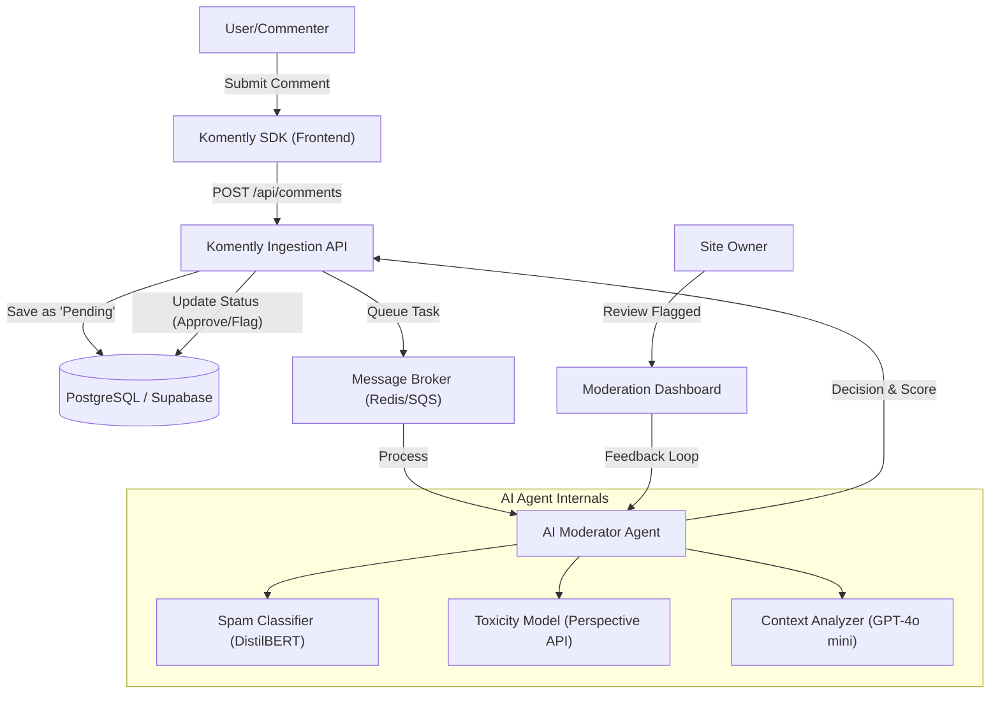

# AI Agent Planning Document: Komently

## 1. Project Overview

### Website Topic and Purpose
**Komently** is an AI-Ready Universal Comment System designed as a plug-and-play solution for third-party websites. The primary purpose is to provide website owners with a sophisticated, scalable, and secure comment infrastructure without the need for bespoke backend development. It bridges the gap between simple static sites and highly interactive platforms by offering a robust "Comments-as-a-Service" model.

### Target Users
- **Website Owners & Indie Developers:** Who need a reliable comment system that is easy to integrate.
- **Content Platforms & Bloggers:** Seeking a high-performance, Reddit-style UI for deep community engagement.
- **Community Managers:** Who require advanced moderation tools and insights into user discussions.
- **End-Visitors (Commenters):** Who interact with the comment sections on various platforms using Komently.

### Core Features of the Website
- **Universal SDK Integration:** Seamless integration into any web stack using a single JavaScript snippet.
- **Modern Threaded UI:** Performance-optimized, nested comment sections designed for high-engagement discussions.
- **Interactive Engagement:** Built-in support for upvotes/downvotes, real-time reactivity, and user authentication.
- **Unified Command Center (Dashboard):** A mock-up interface for developers to manage multiple comment sections, view statistics, and configure site-wide settings.
- **Deeply Customizable:** Theming and styling options that allow the comment section to match the aesthetic of any host website.

---

## 2. AI Agent Concept

### What problem will the AI agent solve?
Manual moderation is one of the most significant hurdles for growing online communities. It is time-consuming, expensive, and often inconsistent. The **Komently AI Moderator Agent** solves these problems by providing:
- **Scalable Moderation:** Handling thousands of comments per second, which would be impossible for human teams.
- **Toxicity and Spam Detection:** Automatically filtering out harassment, hate speech, and bot-generated link spam.
- **Discovery Optimization:** Surfacing high-quality, constructive comments while suppressing low-effort noise through smart re-ranking.

### What type of agent will it be?
The AI agent is a multi-modal **Moderator and Advisor Agent**. It serves as a primary evaluator of content and an assistant to human moderators by flagging edge cases for review rather than just acting as a simple filter.

### How users will interact with the agent
- **Background Automation:** Most interactions happen silently; the agent scores every comment in the background before publication.
- **Transparent Notifications:** Users are notified if their comment is pending review or was flagged for policy violations.
- **Human-in-the-Loop Dashboard:** Site owners interact with the agent via a "Moderation Queue" where they can approve or reject AI-flagged comments, providing vital feedback that fine-tunes the agent's performance.

---

## 3. System Architecture (High-Level)

The AI Moderator Agent is integrated as an asynchronous worker within the Komently ecosystem to ensure high availability and low latency for the frontend.

### Architecture Diagram

### Component Details
- **Frontend (SDK):** Captures user input and handles optimistic UI updates, showing the author their comment immediately while it is being processed by the agent.
- **Backend (Ingestion API):** Acts as the orchestrator, validating tokens and routing messages to the persistent store and the AI processing queue.
- **External AI Services:**
    - **Perspective API:** Industry-standard model for toxicity scoring.
    - **OpenAI (GPT-4o mini):** Used for advanced context analysis, determining if a comment is relevant to the thread or just "noise."
- **Feedback Store:** Every human override of an AI decision is logged, creating a dataset for future reinforcement learning to improve the agent's accuracy over time.
