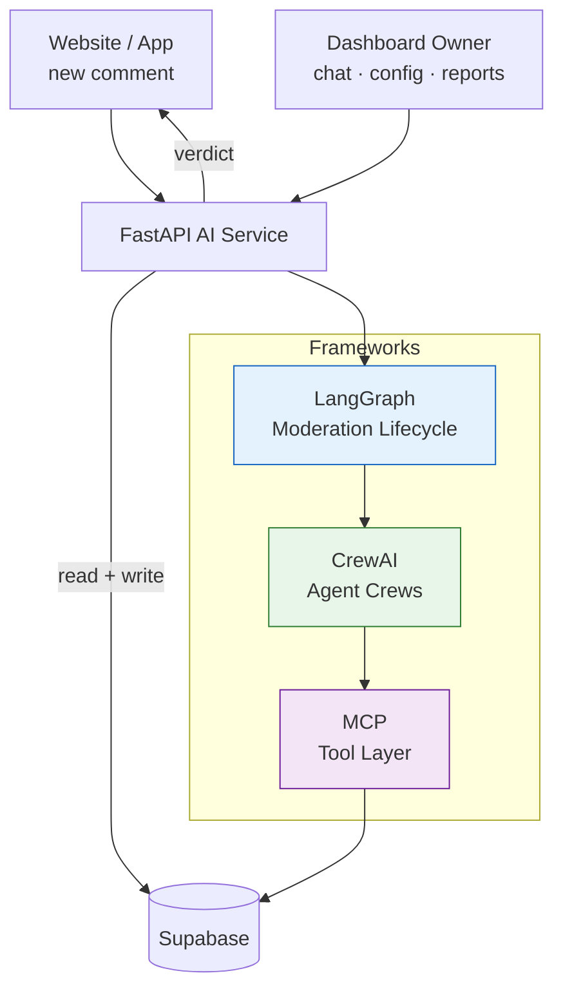
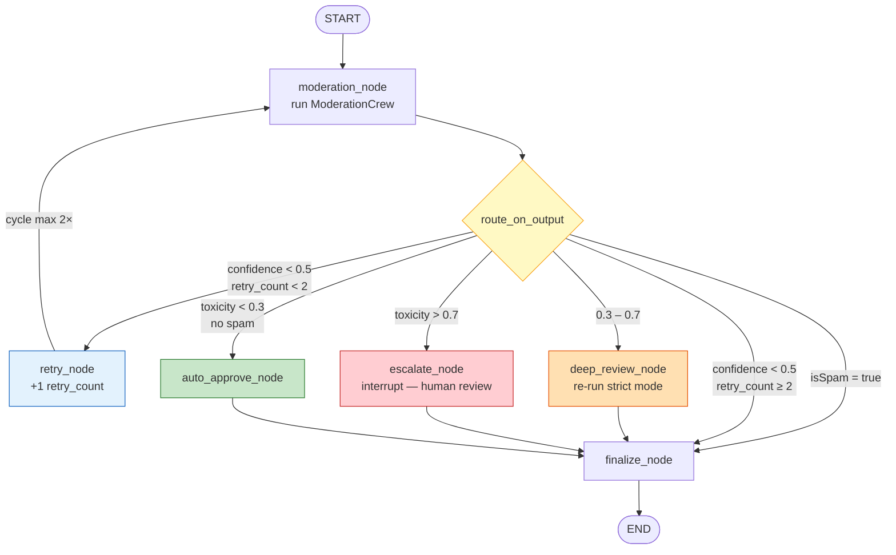
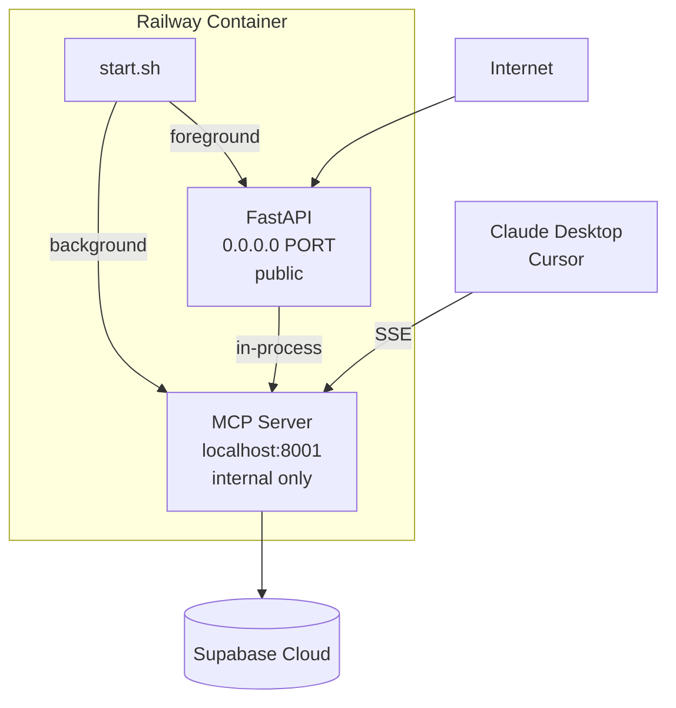

# Komently – Advanced Web Programming Assignment

## 1. Project Overview

### 1.1 Website Topic and Purpose

Komently is an AI-powered comment moderation SaaS. Website owners embed a comment section on their site; Komently's AI service evaluates every incoming comment in real time and decides whether to approve, flag, shadow-hide, or reject it. Section owners manage their community through a dashboard that lets them configure rules, chat with an AI copilot, and receive weekly analytics reports.

### 1.2 Target Users

- Website owners and indie developers who need an easy, self-moderating comment system
- Bloggers and content platforms that require community interaction
- Moderators who manage discussions through the dashboard
- Website visitors who participate in comment threads

### 1.3 Core Features

- Embed-ready comment widget with a simple script tag
- Real-time AI moderation: approve, flag, shadow-hide, or reject comments automatically
- Human escalation flow: high-toxicity comments pause for moderator review
- Dashboard with AI copilot chat for configuration and moderation actions
- Weekly analytics reports generated by an analyst agent
- MCP tool server accessible by Claude Desktop and Cursor IDE

---

## 2. Technologies Used

| Layer | Technology |
|---|---|
| Frontend Framework | Next.js |
| Frontend Hosting | Vercel |
| Backend APIs | Next.js API Routes (Vercel) |
| AI Service | FastAPI |
| AI Service Hosting | Railway |
| Agentic Frameworks | LangGraph, CrewAI |
| Tool Layer | MCP (FastMCP) |
| LLM | OpenAI GPT-4o-mini |
| Database | Supabase PostgreSQL |
| Authentication | Supabase Auth |
| Version Control | Git and GitHub |

---

## 3. AI Service Architecture

The AI service is a **FastAPI application** backed by three agentic frameworks — each with a distinct, non-overlapping responsibility.

### 3.1 API Endpoints

| Endpoint | Trigger | Returns |
|---|---|---|
| `POST /moderate` | Every new comment | Moderation verdict JSON |
| `POST /chat` | Dashboard owner message | Reply + list of actions taken |
| `POST /generate-report` | Internal trigger from `trigger_intel_report` | `202 Accepted` — report saved async |
| `PATCH /moderate/{thread_id}/resume` | Moderator human decision | Final verdict after human review |

### 3.2 LangGraph — Moderation Lifecycle

LangGraph manages the stateful lifecycle of a single comment through confidence-based routing, optional retries, deep review, and human escalation.

### 3.3 CrewAI — Agent Crews

Three crews are defined in `crew.py`:

- **ModerationCrew** — Hierarchical process. Three specialist agents (spam, toxicity, context) evaluate a comment independently; a Manager LLM synthesises their findings into a single JSON verdict.
- **ChatCrew** — A single manager agent with full read/write tool access, used for dashboard copilot chat.
- **AnalystCrew** — A single analyst agent that fetches 7 days of analytics and writes a Markdown report as a FastAPI `BackgroundTask`.

### 3.4 MCP — The Tool Layer

`tools/mcp_server.py` is the single source of truth for every database operation in the service. All 9 tools are available in-process to CrewAI agents (via `mcp_adapter.py`), called directly by `main.py`, and also served externally over SSE on port 8001 for Claude Desktop and Cursor.

| Tool | Operation | Table |
|---|---|---|
| `fetch_section_settings` | Read | `comment_sections` |
| `fetch_recent_comments` | Read | `comments` |
| `update_comment_status` | Write | `comments` |
| `update_section` | Write | `comment_sections` |
| `fetch_parent_thread` | Read | `comments` |
| `trigger_intel_report` | Insert + HTTP ping | `section_reports` |
| `fetch_weekly_analytics` | Read | `section_analytics_daily` |
| `fetch_top_comments` | Read | `comments` |
| `update_report_status` | Write | `section_reports` |

---

## 4. Deployment

Both the FastAPI app and the MCP server run inside the same Railway container. `start.sh` launches the MCP server as a background process on port 8001, then starts FastAPI on the Railway-assigned `$PORT`.

---

## 5. File Map

| File | Role |
|---|---|
| `main.py` | FastAPI app — 4 endpoints, lifespan, error handling |
| `graph.py` | LangGraph moderation workflow — state, nodes, routing, fallback chain |
| `crew.py` | CrewAI crew definitions — ModerationCrew, ChatCrew, AnalystCrew |
| `tools/mcp_server.py` | Single source of truth — all 9 tool implementations + SSE transport |
| `tools/mcp_adapter.py` | MCPTool wrappers — bridges CrewAI BaseTool → MCP functions in-process |
| `config/agents.yaml` | Agent roles, goals, and backstories |
| `config/tasks.yaml` | Task descriptions and expected output formats |
| `railway.toml` | Railway build and deploy configuration |
| `start.sh` | Process launcher — MCP server then FastAPI |
| `claude_desktop_config.json` | MCP connection config for Claude Desktop / Cursor |

---

## Links

- **GitHub:** https://github.com/emircan-gezer/Komently
- **Live Site:** https://komently.vercel.app/
