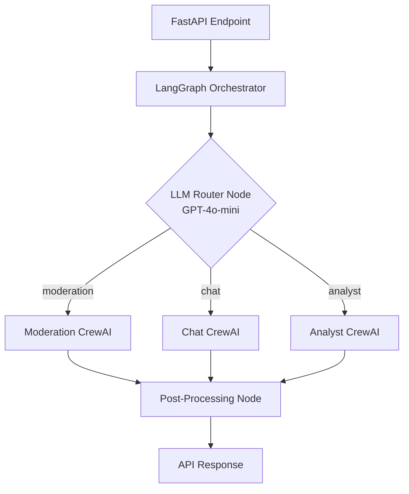
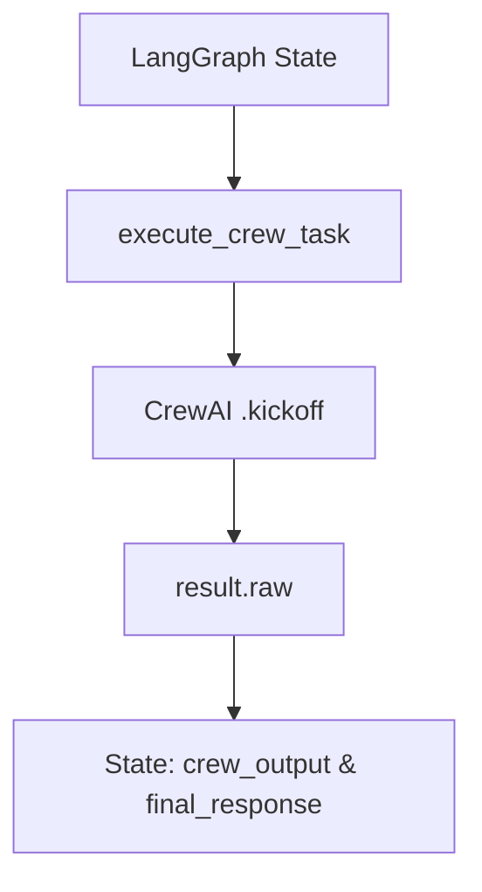

# LangGraph Integration Report
## Komently AI Service

**Student:** Emircan Gezer
**Date:** April 19, 2026

---

## 1. Project Overview

Komently is an AI-powered comment moderation SaaS. This report documents the integration of **LangGraph** as the orchestration layer alongside **CrewAI** multi-agent crews inside the existing FastAPI `ai-service`.

Both frameworks cooperate — LangGraph handles routing and shared state, CrewAI handles specialised agent execution.

---

## 2. Implementation Steps

1. **Defined a shared state schema** — `GraphState` TypedDict read by both LangGraph nodes and CrewAI bridge code.
2. **Built an LLM-powered router node** — GPT-4o-mini classifies each request into `moderation`, `chat`, or `analyst`.
3. **Created crew nodes** — each delegates to a CrewAI crew via the `execute_crew_task()` bridge function.
4. **Added a finalize node** — standardises all crew outputs before returning to the caller.
5. **Compiled the graph** with `MemorySaver` for in-memory thread-level persistence.
6. **Integrated LangSmith** — full tracing of every LLM call and tool use with zero extra instrumentation.
7. **Connected to FastAPI** — all three API endpoints invoke the same compiled `komently_app` instance.

---

## 3. Architecture



---

## 4. LangGraph Graph — `graph.py`

The graph is exported as a single compiled instance `komently_app`.

**GraphState fields:**

| Field | Purpose |
|-------|---------|
| `input` | Raw user message or comment body |
| `section_id` | Target Komently section |
| `history` | Conversation turns (used by `/chat`) |
| `next_action` | Routing decision set by the router |
| `crew_output` | Parsed result from the crew |
| `final_response` | Cleaned string returned to the caller |
| `metadata` | Origin endpoint, comment_id, tracing flags |

**Nodes:**

| Node | Function | Purpose |
|------|----------|---------|
| `router` | `intelligent_router()` | GPT-4o-mini classifies the request |
| `moderator` | `moderation_node()` | Runs ModerationCrew |
| `chat` | `chat_node()` | Runs ChatCrew |
| `analyst` | `analyst_node()` | Runs AnalystCrew |
| `finalize` | `post_process_node()` | Standardises all outputs |

A conditional edge from `router` reads `next_action` and dispatches to the matching crew node. All three paths converge at `finalize`, then `END`.

---

## 5. CrewAI Integration — `crew.py`

The bridge between frameworks is `execute_crew_task()` in `graph.py`. It maps LangGraph state into a flat CrewAI input dict, calls `.kickoff()`, and writes the result back into state.



**Three crews:**

| Crew | Agents | Purpose |
|------|--------|---------|
| `ModerationCrew` | Fetcher → Manager → Moderator | Reads settings, builds rulebook, outputs JSON verdict |
| `ChatCrew` | Manager | Dashboard queries, config changes, community management |
| `AnalystCrew` | Analyst | Fetches 7-day analytics, writes Markdown report to DB |

---

## 6. API Endpoints — `main.py`

All three endpoints invoke `komently_app` with a unique `thread_id` for session persistence.

| Endpoint | Method | Crew | Response |
|----------|--------|------|---------|
| `/moderate` | POST | ModerationCrew | JSON: status, toxicity score, isSpam |
| `/chat` | POST | ChatCrew | Text reply + actions taken list |
| `/generate-report` | POST | AnalystCrew | 202 Accepted (background task) |

---

## 7. LangSmith Integration

Two environment variables in `graph.py` enable full tracing — no additional instrumentation required:

```python
os.environ["LANGCHAIN_TRACING_V2"] = "true"
os.environ["LANGCHAIN_PROJECT"]    = "Komently-Advanced-Orchestrator"
```

Every invocation — router classification, agent reasoning, Supabase tool calls — is recorded in the **Komently-Advanced-Orchestrator** LangSmith project.

---

## 8. Key Files

| File | Role |
|------|------|
| `graph.py` | LangGraph graph: state, nodes, edges, compilation |
| `crew.py` | CrewAI crew and agent definitions |
| `main.py` | FastAPI app — imports and invokes `komently_app` |
| `config/agents.yaml` | Agent roles, goals, backstories |
| `config/tasks.yaml` | Task descriptions and expected outputs |
| `tools/supabase_tools.py` | Supabase tools used by Fetcher and Manager agents |
| `tools/analyst_tools.py` | Analytics tools used by Analyst agent |

---

## 9. Git Repository

**https://github.com/emircan-gezer**

---

*Report generated for course submission — April 2026*
