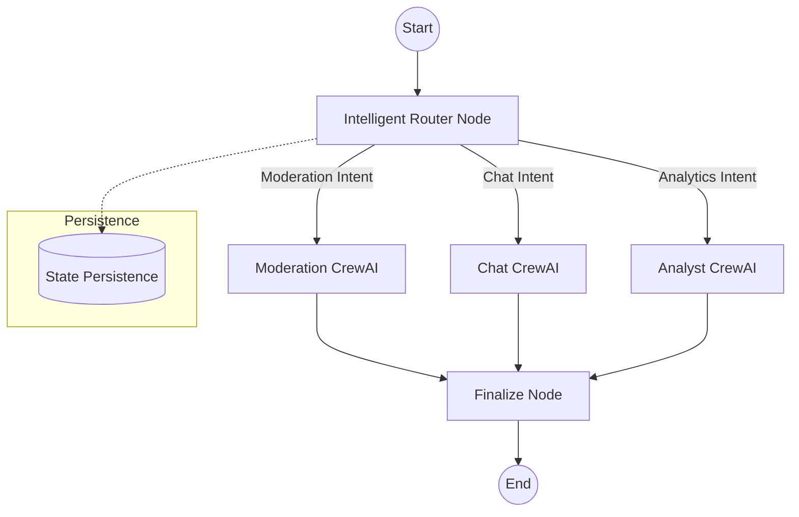

# Komently AI Service: LangGraph & CrewAI Integration Report

## 1. Project Overview
This report documents the integration of **LangGraph** as a high-level orchestrator for the existing **CrewAI** agents within the Komently AI Service. The goal was to create a robust, stateful, and observable AI workflow that can intelligently route user requests to specialized crews.

## 2. Implemented Features

### A. LangGraph Orchestration
We replaced direct crew calls with a state-machine based orchestrator in `graph.py`. 
- **Nodes**: Defined discrete steps for Routing, Moderation, Chat, and Analytics.
- **State Management**: A global `GraphState` tracks user input, session history, and crew outputs throughout the lifecycle of a request.
- **Persistence**: Implemented `MemorySaver` to allow the graph to remember conversational context across multiple API calls using a unique `thread_id`.

### B. Intelligent Routing
The `router_node` uses an LLM-based classifier that analyzes user intent and message origin. 
- **Efficiency**: Instead of running every agent for every request, the router selects only the necessary CrewAI crew (Moderation, Chat, or Analyst).
- **Flexibility**: The router can override default endpoint behavior if the user's intent clearly shifts (e.g., asking for a report within the chat interface).

### C. LangSmith Observability
Full integration with **LangSmith** has been implemented to provide:
- **Tracing**: Every step of the graph execution is tracked.
- **Performance Monitoring**: Latency and token usage are monitored per node.
- **Debugging**: Deep visibility into the specific tools and prompts used by the underlying CrewAI agents.

### D. CrewAI Synergy
LangGraph handles the high-level flow (the "brain"), while CrewAI agents handle the low-level task execution (the "hands"). This hybrid approach leverages the best of both frameworks.

## 3. Implementation Details

### Workflow Diagram

### Steps Defined
1. **Input Reception**: FastAPI receives an HTTP request and identifies the `section_id` and `origin`.
2. **State Initialization**: A `GraphState` is created with a `thread_id` linked to the user/section.
3. **Routing**: The Router node classifies the request.
4. **Execution**: The relevant crew is kicked off with the state's context.
5. **Formatting**: The Finalize node cleans the crew output into a consistent JSON schema.

## 4. Advanced Integration Pattern
Based on best practices, we implemented a "Better way" to blend both frameworks:

### A. CrewAI as a 'Plugin' to LangGraph
Instead of treating CrewAI as a simple script to run, we treat it as a **specialized worker** within the LangGraph state machine. 
- **Explicit Handoff**: control logic (routing, validation) stays in LangGraph.
- **Granular Execution**: task execution stays in CrewAI.

### B. Unified State schema
We moved away from passing strings and moved towards a **Unified TypedDict State**.
- The `execute_crew_task` wrapper ensures that LangGraph's history and metadata are correctly mapped to CrewAI's `inputs`.
- This ensures that when an agent in CrewAI runs a tool, it has the full context from the LangGraph session.

### C. Post-Processing Standardization
A dedicated `finalize` node in LangGraph ensures that regardless of which crew ran, the output is cleaned and structured before being sent to the FastAPI response.

## 5. Metadata
- **Frameworks**: LangGraph 0.2+, CrewAI 0.11+, LangChain 0.3+
- **Persistence Strategy**: In-memory `MemorySaver` (Production-ready for Redis/Postgres).
- **Observability**: LangSmith (Active - Project: "Komently-Advanced-Orchestrator").
