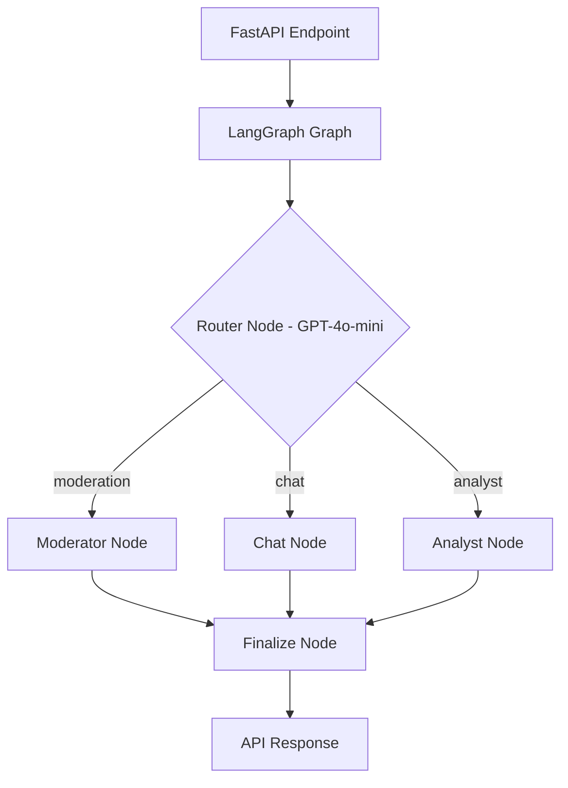
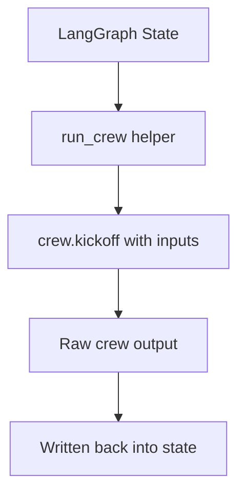

# LangGraph Implementation Report
## Komently AI Service

**Author:** Emircan Gezer
**Date:** April 20, 2026

---

## 1. Project Overview

Komently is an AI-powered comment moderation SaaS. This report documents how **LangGraph** is implemented as the orchestration layer on top of the existing **CrewAI** agents inside the FastAPI `ai-service`.

The two frameworks have clear responsibilities:
- **LangGraph** — routes requests, manages shared state, standardises outputs
- **CrewAI** — runs the actual agents (moderation, chat, analytics)

---

## 2. Architecture



The graph is compiled once at startup and exported as `komently_app`. All three API endpoints import and reuse the same instance.

---

## 3. Graph State — `graph.py`

All nodes share a single `GraphState` TypedDict. Nodes never call each other directly — they only read from and write to this state.

| Field | Purpose |
|-------|---------|
| `input` | User message or comment body |
| `section_id` | Target Komently section |
| `history` | Conversation turns (used by `/chat`) |
| `next_action` | Routing decision written by the router |
| `crew_output` | Parsed result returned by the crew |
| `result` | Final cleaned output sent to the API |
| `origin` | Which endpoint triggered the request |
| `flags` | Extra data such as `report_id` |

---

## 4. Nodes

| Node | File | Purpose |
|------|------|---------|
| `router` | `graph.py` | GPT-4o-mini classifies the request into `moderation`, `chat`, or `analyst`. Falls back to `chat` on error. |
| `moderator` | `graph.py` | Runs `ModerationCrew` — fetches context, builds rulebook, returns JSON verdict. |
| `chat` | `graph.py` | Runs `ChatCrew` — answers dashboard questions, can update section settings. |
| `analyst` | `graph.py` | Runs `AnalystCrew` — fetches 7-day stats, writes Markdown report to DB. Always background. |
| `finalize` | `graph.py` | Parses JSON from crew output if present, passes plain text through otherwise. |

---

## 5. CrewAI Integration — `crew.py`

The only connection between LangGraph and CrewAI is the `run_crew()` helper. Every crew node calls it.



**Three crews:**

| Crew | Agents | Output |
|------|--------|--------|
| `ModerationCrew` | Fetcher → Manager → Moderator | `{ status, toxicityScore, isSpam, reason }` |
| `ChatCrew` | Manager | Text reply + list of actions taken |
| `AnalystCrew` | Analyst | Markdown report saved to the database |

---

## 6. API Endpoints — `main.py`

All three endpoints call `komently_app.invoke(inputs)` and differ only in what they pass in and extract from the output.

| Endpoint | Method | Crew | Response |
|----------|--------|------|----------|
| `/moderate` | POST | ModerationCrew | `200` — verdict JSON |
| `/chat` | POST | ChatCrew | `200` — reply + actions |
| `/generate-report` | POST | AnalystCrew | `202` Accepted (runs in background) |

---

## 7. Observability — LangSmith

Two environment variables in `graph.py` enable full tracing. No extra instrumentation needed.

```python
os.environ["LANGCHAIN_TRACING_V2"] = "true"
os.environ["LANGCHAIN_PROJECT"]    = "Komently-Advanced-Orchestrator"
```

Every LLM call, agent reasoning step, and Supabase tool call is automatically recorded in the **Komently-Advanced-Orchestrator** LangSmith project.

---

## 8. Key Files

| File | Role |
|------|------|
| `graph.py` | LangGraph graph — state, nodes, edges, compilation |
| `crew.py` | CrewAI crew and agent definitions |
| `main.py` | FastAPI app — imports and invokes `komently_app` |
| `config/agents.yaml` | Agent roles, goals, and backstories |
| `config/tasks.yaml` | Task descriptions and expected outputs |
| `tools/supabase_tools.py` | Database tools used by Fetcher and Manager agents |
| `tools/analyst_tools.py` | Analytics tools used by the Analyst agent |

---

*April 2026*
