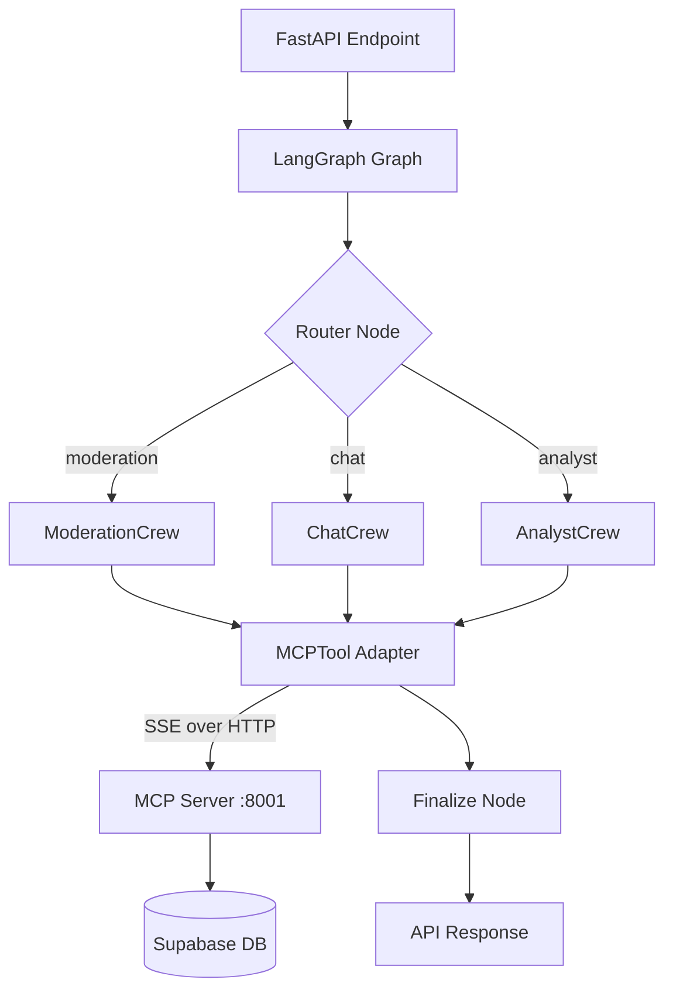
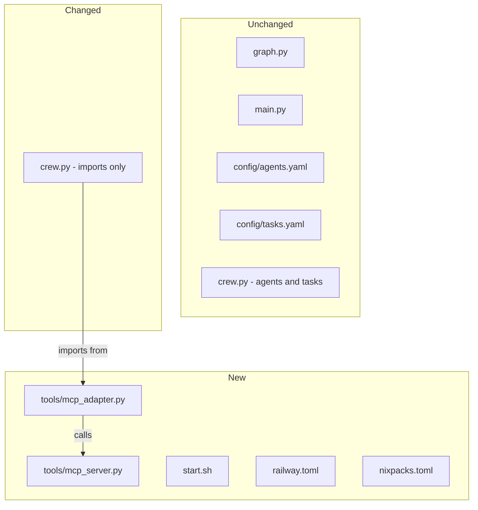
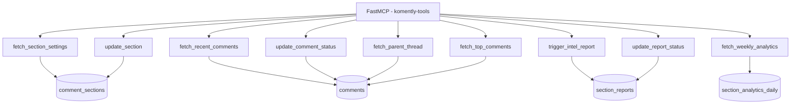
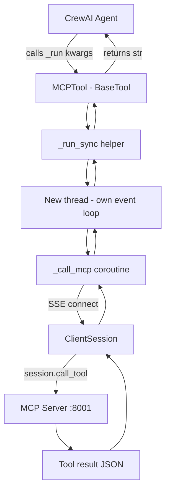
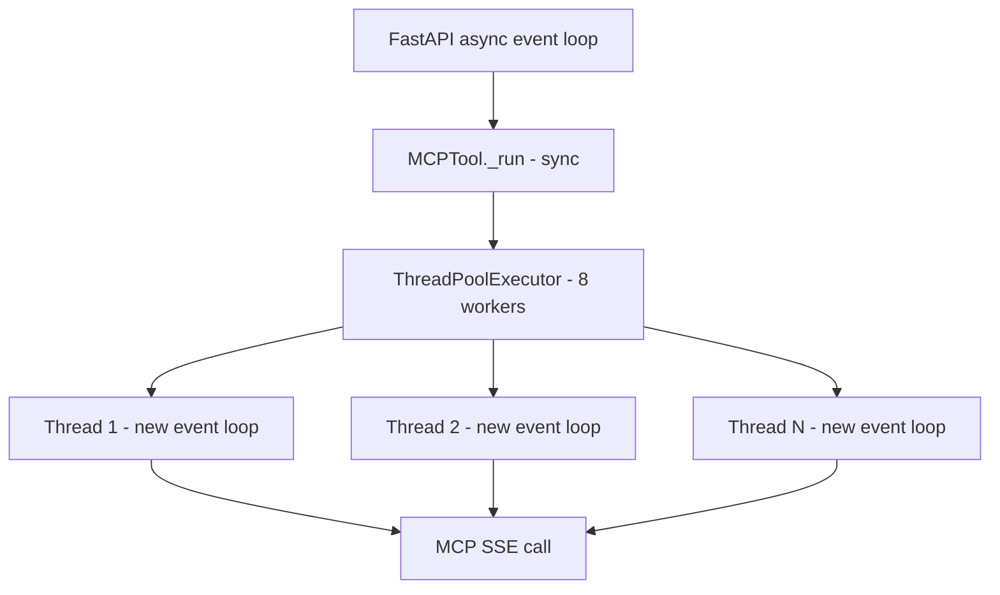
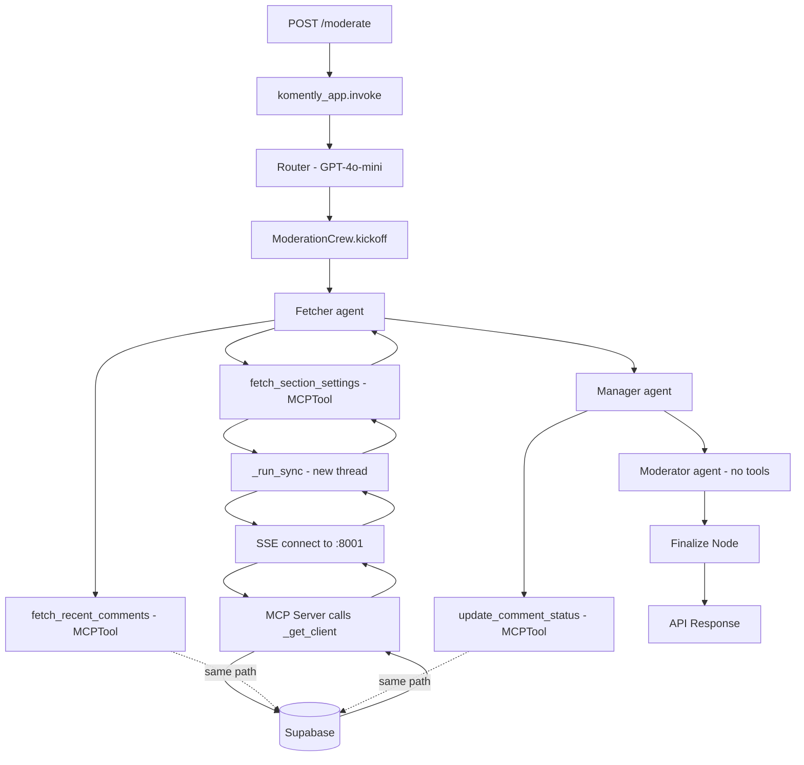
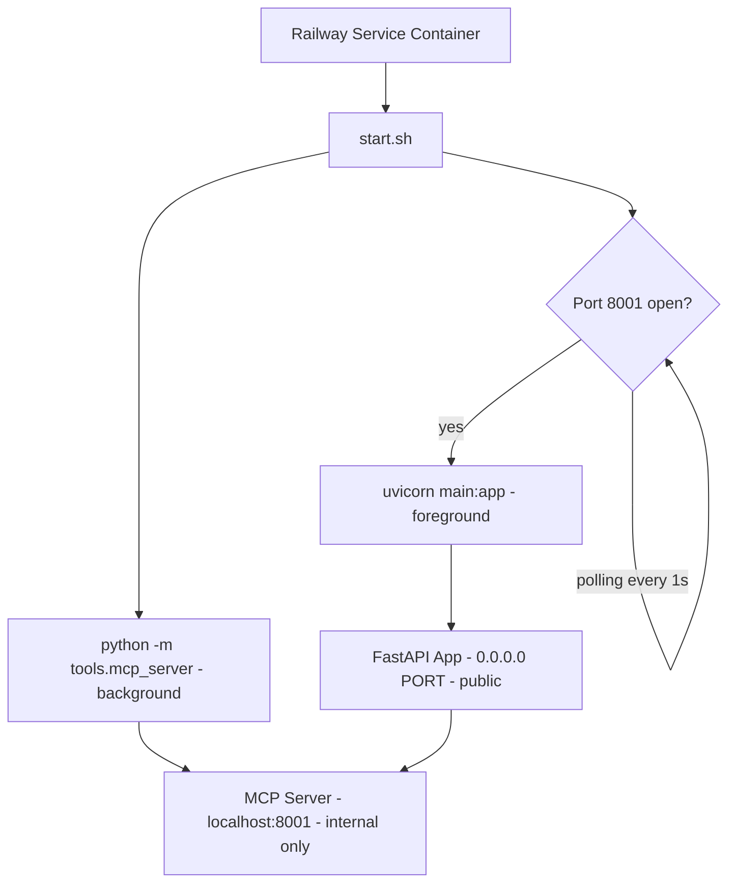
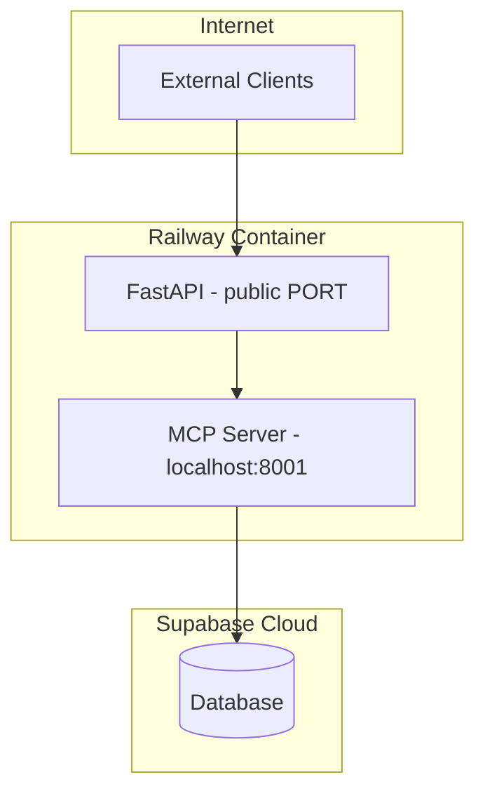

# MCP Implementation Report
## Komently AI Service

**Author:** Emircan Gezer
**Date:** May 5, 2026

---

## 1. Overview

This report documents how **Model Context Protocol (MCP)** is integrated into the Komently AI service as the tool layer, sitting between **CrewAI agents** and the **Supabase database** — without replacing or modifying the existing LangGraph or CrewAI architecture.

The three frameworks now have distinct, non-overlapping responsibilities:

| Framework | Responsibility |
|-----------|---------------|
| **LangGraph** | Routes requests, manages shared state, standardises outputs |
| **CrewAI** | Defines agents, tasks, and crew orchestration |
| **MCP** | Exposes all database tools as a self-describing protocol server |

---

## 2. Full Architecture

Both the FastAPI app and the MCP server run inside the same container. The MCP server is bound to `localhost:8001` and is never publicly exposed — it is an internal process only reachable by the FastAPI process.

---

## 3. What Changed vs. What Stayed the Same

The only modification to existing files is **three import lines** in `crew.py`. Everything else — graph topology, crew definitions, agent configs, task configs, and API endpoints — is completely untouched.

---

## 4. MCP Server — `tools/mcp_server.py`

The server is built with `FastMCP` and exposes all nine tools as decorated functions over **SSE (Server-Sent Events) transport** on port 8001.

Each function is a plain Python function decorated with `@mcp.tool()`. MCP auto-generates the JSON schema for the LLM from the type annotations and docstring — no Pydantic model boilerplate needed on the server side.

### Tool Groupings

| Group | Tools | Tables accessed |
|-------|-------|-----------------|
| Read | `fetch_section_settings`, `fetch_recent_comments`, `fetch_parent_thread`, `fetch_weekly_analytics`, `fetch_top_comments` | Read-only |
| Write | `update_comment_status`, `update_section`, `update_report_status` | Write |
| Trigger | `trigger_intel_report` | Insert + HTTP fire-and-forget |

---

## 5. MCP Adapter — `tools/mcp_adapter.py`

The adapter is the bridge between CrewAI and the MCP server. It has three responsibilities:

1. Define a generic `MCPTool(BaseTool)` that forwards any `_run()` call to the MCP server via SSE
2. Define the Pydantic input schemas so the LLM receives accurate parameter descriptions
3. Export pre-instantiated tool objects under the original names so `crew.py` needs no structural changes

### Thread-Safety

FastAPI runs on an async event loop. CrewAI calls tools synchronously inside that loop. Using `asyncio.run()` from inside an existing event loop raises a `RuntimeError`. The adapter solves this by always dispatching to a **dedicated `ThreadPoolExecutor`** where each worker creates its own isolated event loop:

This means multiple agents running concurrently each get their own MCP connection without blocking the main event loop.

---

## 6. Tool Call Flow — End to End

---

## 7. Railway Deployment

On Railway, a **single service** runs both processes. The startup script (`start.sh`) launches the MCP server as a background process, waits for its port to open, then starts the FastAPI app in the foreground bound to the Railway-assigned `$PORT`.

### Network Boundaries

The MCP server has **no public route**. Only the FastAPI process can reach it. Supabase is accessed from the MCP server using the service-role key stored as a Railway environment variable.

### Environment Variables

| Variable | Where set | Purpose |
|----------|-----------|---------|
| `SUPABASE_URL` | Railway dashboard | Supabase project URL |
| `SUPABASE_SERVICE_ROLE_KEY` | Railway dashboard | DB admin key |
| `OPENAI_API_KEY` | Railway dashboard | LLM calls |
| `LANGSMITH_*` | Railway dashboard | Tracing (optional) |
| `MCP_SERVER_URL` | Railway dashboard | `http://localhost:8001/sse` |
| `MCP_SERVER_PORT` | Set by `start.sh` | `8001` |
| `PORT` | Set by Railway | FastAPI public port |

---

## 8. Key Files

| File | Role |
|------|------|
| `tools/mcp_server.py` | FastMCP server — all 9 tool implementations, SSE transport |
| `tools/mcp_adapter.py` | `MCPTool` class, Pydantic schemas, pre-built tool instances |
| `crew.py` | CrewAI definitions — only import block updated |
| `start.sh` | Process launcher — starts MCP server then FastAPI |
| `railway.toml` | Railway build and deploy configuration |
| `nixpacks.toml` | Nixpacks build phases — Python 3.12, pip install |
| `.env.example` | Documents all required environment variables |

---

## 9. Benefits of the MCP Layer

| Concern | Before MCP | After MCP |
|---------|-----------|-----------|
| Tool reuse | Coupled to CrewAI `BaseTool` only | Any MCP-compatible client can call the same tools |
| Boilerplate | Pydantic schema + `_run()` per tool | Just a typed function + docstring |
| Testability | Must instantiate a CrewAI tool to test | Tools are plain functions, callable in isolation |
| Observability | Tool calls visible only in CrewAI logs | MCP protocol layer adds a dedicated tracing point |
| Future extensibility | New consumers require new tool wrappers | New consumers connect to the existing MCP server |

---

*May 2026*
