# Komently AI Service — Project Summary
**Author:** Emircan Gezer
**Date:** May 2026

---

## 1. What Is Komently?

Komently is an AI-powered comment moderation SaaS. Website owners embed a comment section on their site; Komently's AI service evaluates every incoming comment in real time and decides whether to approve, flag, shadow-hide, or reject it. Section owners manage their community through a dashboard that lets them configure rules, chat with an AI copilot, and receive weekly analytics reports.

The AI service is a **FastAPI application** backed by three agentic frameworks — each with a distinct, non-overlapping responsibility.

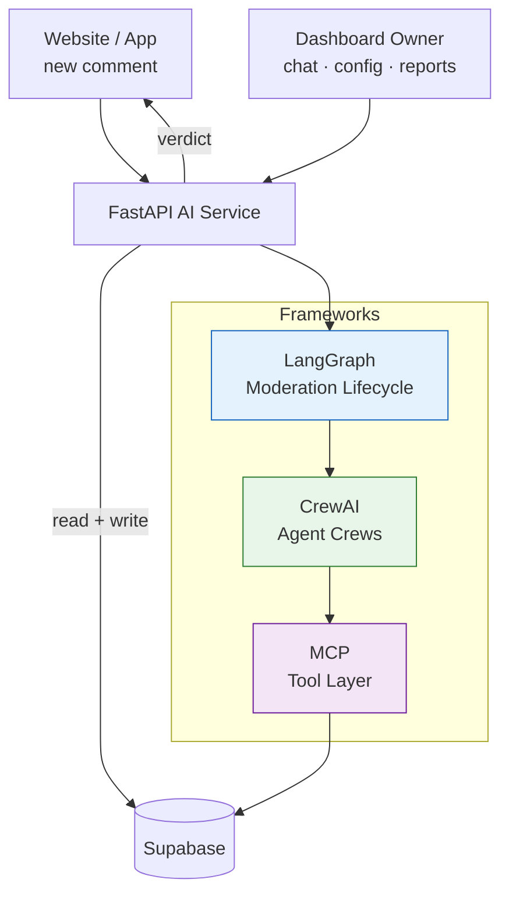

---

## 2. API Endpoints

Four endpoints. Each has a distinct owner in the framework stack.

| Endpoint | Trigger | Returns |
|---|---|---|
| `POST /moderate` | Every new comment | Moderation verdict JSON |
| `POST /chat` | Dashboard owner message | Reply + list of actions taken |
| `POST /generate-report` | Internal trigger from `trigger_intel_report` | `202 Accepted` — report saved async |
| `PATCH /moderate/{thread_id}/resume` | Moderator human decision | Final verdict after human review |

---

## 3. Endpoint Deep-Dives

### 3.1 `POST /moderate`

Runs the full stateful moderation lifecycle via LangGraph. Every comment travels through confidence-based routing, optional retries, optional deep review, and optional human escalation before a final verdict is written.

**Request:**
```json
{
  "comment_id": "uuid",
  "section_id": "uuid",
  "body": "comment text",
  "parent_id": "uuid | null"
}
```

**Response (`ModerationVerdict`):**
```json
{
  "status": "approved | flagged | rejected | shadow_hidden",
  "action": "approved | flagged | rejected | shadow_hidden",
  "toxicity_score": 0.0,
  "is_spam": false,
  "reason": "brief explanation",
  "metadata": { "sentiment_score": 0.0, "confidence": 1.0 }
}
```

**Flow:**

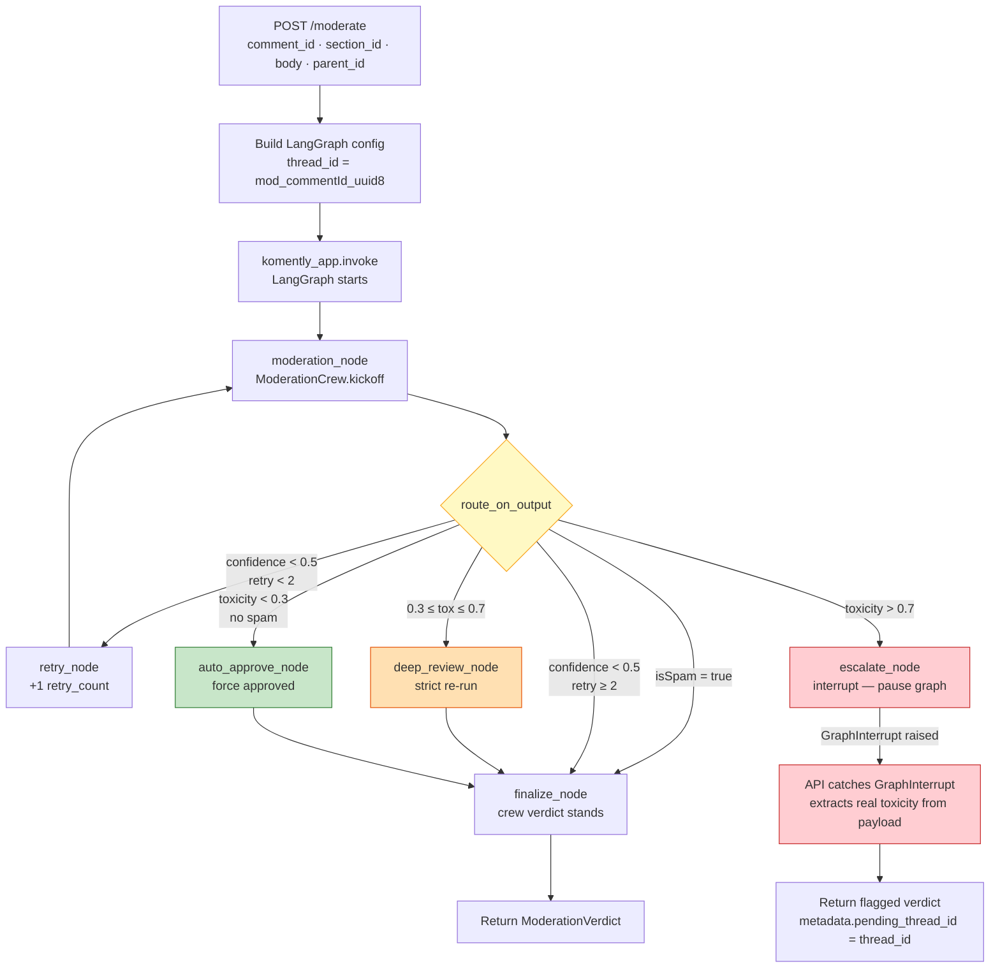

**Error handling:**
- `GraphInterrupt` → returns `flagged` + `pending_thread_id` for human review
- Any other exception → fail-safe `approved` response (never silently blocks users)
- Empty/unparseable crew output → `finalize_node` falls back to `crew_output`, then to a safe `flagged` default

---

### 3.2 `PATCH /moderate/{thread_id}/resume`

Resumes a graph that was paused at `escalate_node` after a human moderator reviews the comment in the dashboard.

**Request:**
```json
{ "status": "approved | rejected | flagged" }
```

**Response:** Same `ModerationVerdict` shape with `metadata.resumed_by_human = true`.

**Flow:**

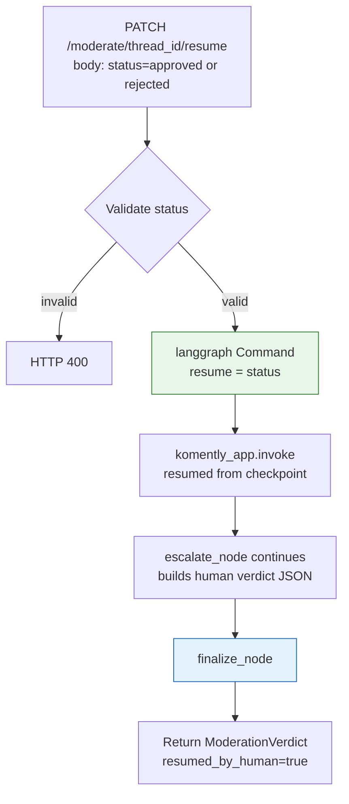

---

### 3.3 `POST /chat`

Dashboard chat. Calls `ChatCrew` directly — no LangGraph overhead needed for a single conversational pass. Before kicking off the crew, the API calls `fetch_section_settings` from `mcp_server.py` directly so the agent can answer configuration questions instantly without spending a tool call of its own.

**Request:**
```json
{
  "section_id": "uuid",
  "message": "user message",
  "history": [{ "role": "user", "content": "..." }]
}
```

**Response:**
```json
{
  "reply": "agent reply text",
  "actions_taken": ["Updated toxicity threshold to 0.7", "..."]
}
```

**Flow:**

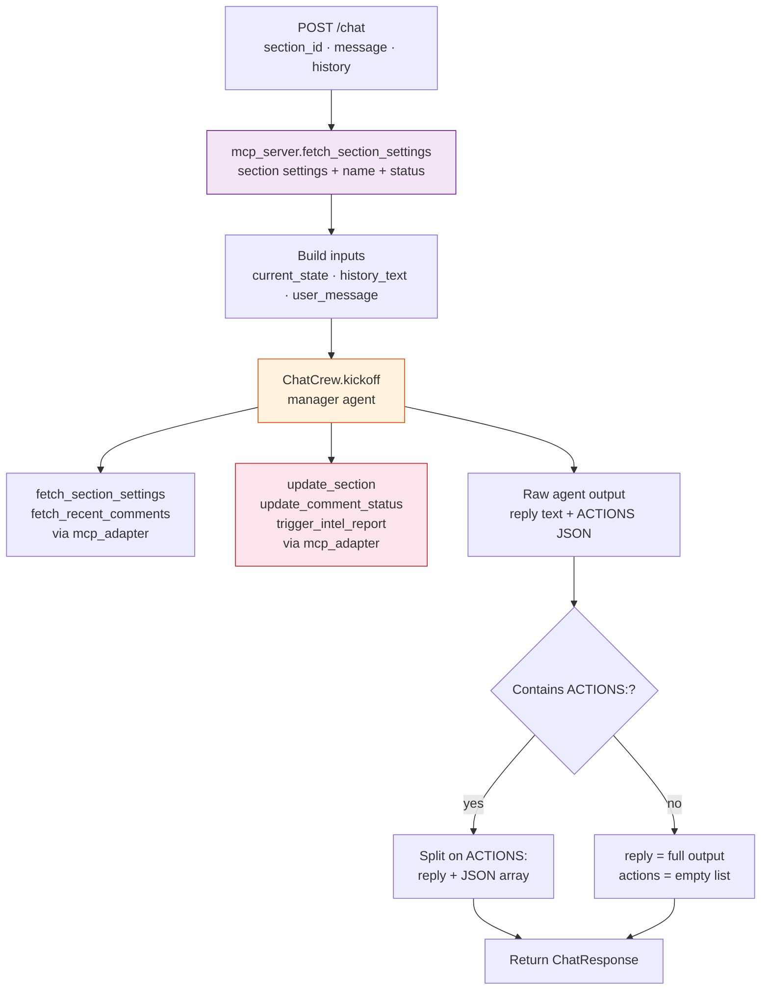

---

### 3.4 `POST /generate-report`

Internal endpoint called by `trigger_intel_report` (MCP tool). Runs `AnalystCrew` as a FastAPI `BackgroundTask` and returns `202` immediately. The crew fetches 7 days of analytics, reads top comments, writes a Markdown report to the database, and marks the row `completed`.

**Request:**
```json
{ "section_id": "uuid", "report_id": "uuid" }
```

**Response:** `{ "status": "processing", "report_id": "uuid" }` (202)

**Flow:**

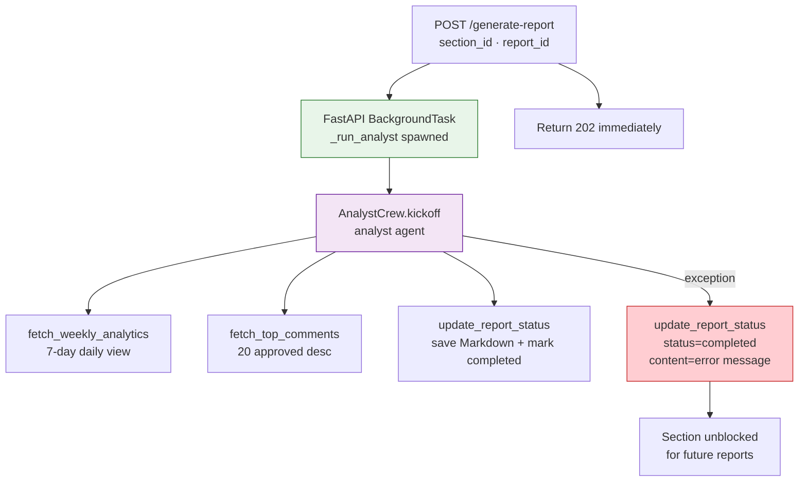

> **Why no LangGraph here?** Report generation is a linear single-pass job: fetch → analyse → write. There's no branching, no retry logic, no human escalation. A direct `BackgroundTask` call is simpler and faster.

---

## 4. MCP — The Tool Layer

MCP (`tools/mcp_server.py`) is the **single source of truth for every database operation in the service**. Every tool is defined here as a `@mcp.tool()` decorated plain Python function. Nothing bypasses it — not the agents, not the API itself.

Three consumers, one tool layer:

- **CrewAI agents** — call MCP functions in-process through `mcp_adapter.py`
- **`main.py` directly** — calls `fetch_section_settings` and `update_report_status` as regular imports for pre-flight data fetching and error recovery
- **External clients** — the same FastMCP instance runs as an SSE server on port 8001, letting Claude Desktop, Cursor, or any MCP-compatible client discover and call all 9 tools

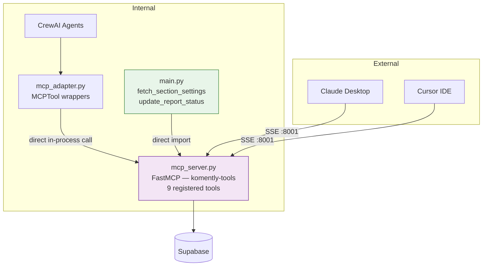

### The 9 Tools

| Tool | Operation | Table |
|---|---|---|
| `fetch_section_settings` | Read | `comment_sections` |
| `fetch_recent_comments` | Read | `comments` |
| `update_comment_status` | Write | `comments` |
| `update_section` | Write | `comment_sections` |
| `fetch_parent_thread` | Read | `comments` |
| `trigger_intel_report` | Insert + HTTP ping | `section_reports` |
| `fetch_weekly_analytics` | Read | `section_analytics_daily` |
| `fetch_top_comments` | Read | `comments` |
| `update_report_status` | Write | `section_reports` |

### The Adapter

`mcp_adapter.py` wraps each MCP tool as a `CrewAI BaseTool` instance. The `MCPTool` class looks up the function by name from a registry and calls it directly — no HTTP, no protocol overhead for internal calls.

```python
class MCPTool(BaseTool):
    mcp_tool_name: str

    def _run(self, **kwargs) -> str:
        return _TOOL_REGISTRY[self.mcp_tool_name](**kwargs)
```

---

## 5. CrewAI — The Agent Layer

Three crews are defined in `crew.py`. All tool access goes through `mcp_adapter.py`.

### 5.1 ModerationCrew

Hierarchical process. Three specialist agents each evaluate the comment independently; a Manager LLM synthesises their findings into a single JSON verdict. The task description embeds the comment text multiple times to ensure the Manager always includes it in every delegation — preventing agents from searching for the comment instead of evaluating the one given to them.

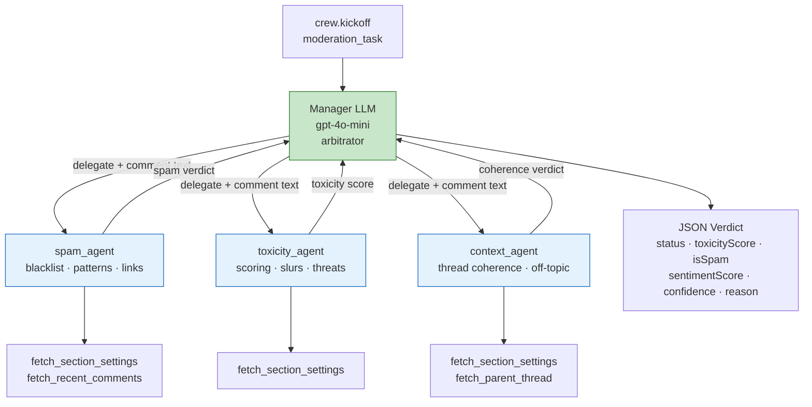

**Output schema:**
```json
{
  "status": "approved | flagged | rejected | shadow_hidden",
  "action": "approved | flagged | rejected | shadow_hidden",
  "toxicityScore": 0.0,
  "isSpam": false,
  "sentimentScore": 0.0,
  "confidence": 1.0,
  "reason": "brief explanation"
}
```

### 5.2 ChatCrew

A single manager agent with full read/write tool access. Called directly from `main.py`.

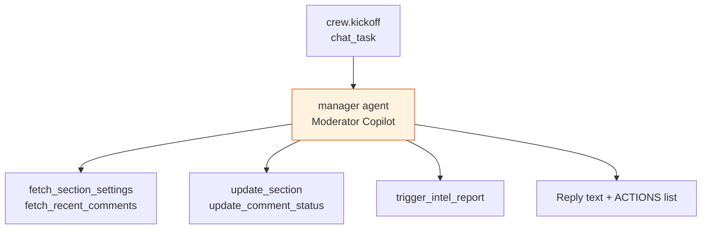

### 5.3 AnalystCrew

A single analyst agent that runs as a FastAPI `BackgroundTask`.

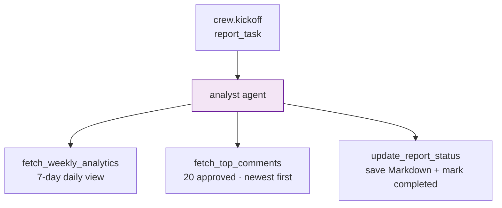

---

## 6. LangGraph — The Moderation Lifecycle

LangGraph manages the **stateful lifecycle** of a single comment. It is used exclusively for `POST /moderate`.

### 6.1 State

```
GraphState
├── input            — comment body (from API)
├── section_id       — section UUID (from API)
├── history          — reserved for future multi-turn use
├── toxicity_score   — written by moderation/deep_review nodes
├── confidence       — written by moderation/deep_review nodes
├── retry_count      — written by retry_node
├── escalation_reason— written by moderation_node
├── crew_output      — final parsed JSON verdict
├── final_response   — raw string output from crew
└── metadata         — comment_id · parent_id · origin
```

### 6.2 Graph Topology

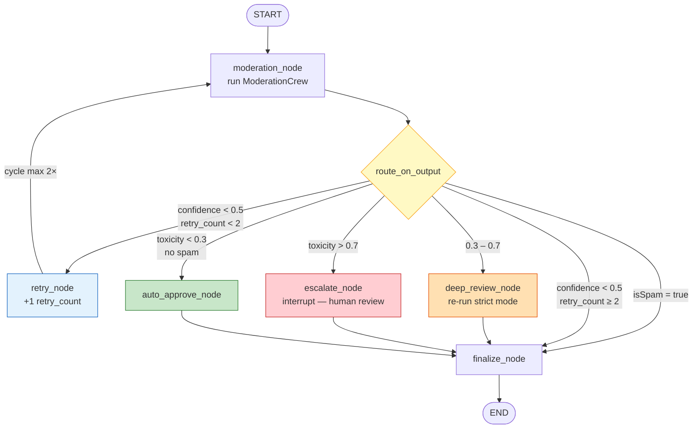

### 6.3 Routing Logic

| Condition | Route | What happens |
|---|---|---|
| `isSpam = true` | → `finalize` | Crew already decided — verdict passes through unchanged |
| `confidence < 0.5` and `retry_count < 2` | → `retry_node` | Increment counter, re-run crew |
| `confidence < 0.5` and `retry_count ≥ 2` | → `finalize` | Give up, pass last verdict through |
| `toxicity > 0.7` | → `escalate_node` | Pause graph, notify moderator |
| `0.3 ≤ toxicity ≤ 0.7` | → `deep_review_node` | Re-run with stricter prompt |
| `toxicity < 0.3` and no spam | → `auto_approve_node` | Fast-approve |

### 6.4 `finalize_node` Fallback Chain

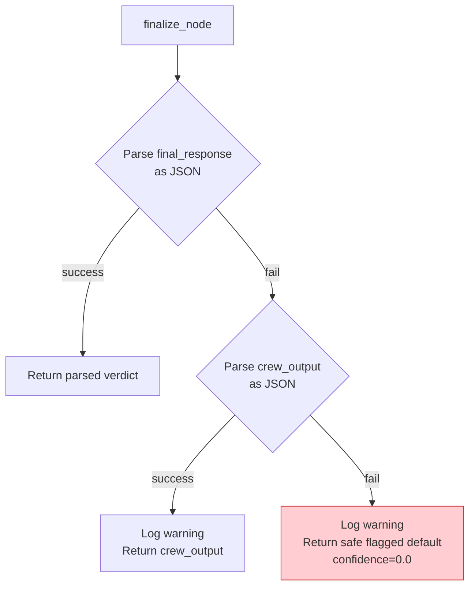

### 6.5 Human Escalation Flow

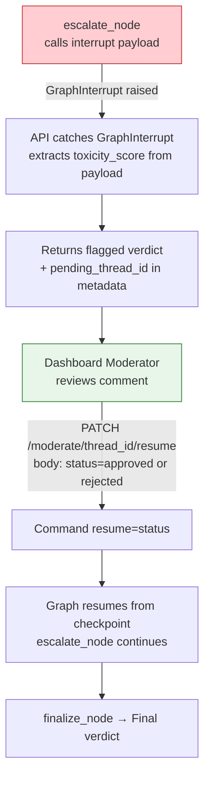

---

## 7. Deployment

Both the FastAPI app and the MCP server run inside the **same Railway container**. `start.sh` launches the MCP server as a background process on port 8001, waits for the port to open, then starts FastAPI on the Railway-assigned `$PORT`.

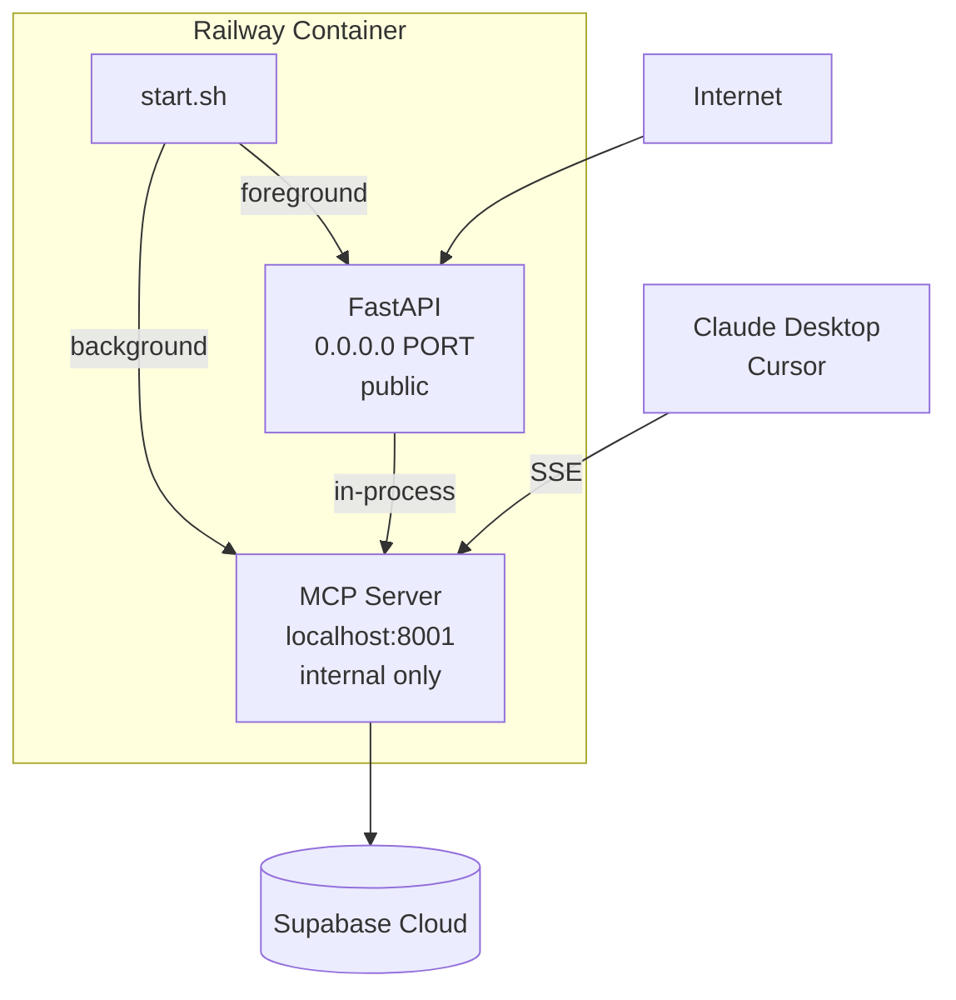

---

## 8. File Map

| File | Role |
|---|---|
| `main.py` | FastAPI app — 4 endpoints, lifespan, error handling; imports MCP tools directly |
| `graph.py` | LangGraph moderation workflow — state, nodes, routing, fallback chain |
| `crew.py` | CrewAI crew definitions — ModerationCrew, ChatCrew, AnalystCrew |
| `tools/mcp_server.py` | **Single source of truth** — all 9 tool implementations + SSE transport |
| `tools/mcp_adapter.py` | MCPTool wrappers — bridges CrewAI BaseTool → MCP functions in-process |
| `config/agents.yaml` | Agent roles, goals, and backstories |
| `config/tasks.yaml` | Task descriptions and expected output formats |
| `railway.toml` | Railway build and deploy configuration |
| `nixpacks.toml` | Nixpacks build phases — Python 3.12, pip install |
| `start.sh` | Process launcher — MCP server then FastAPI |
| `claude_desktop_config.json` | MCP connection config for Claude Desktop / Cursor |

---

## 9. Full System Diagram

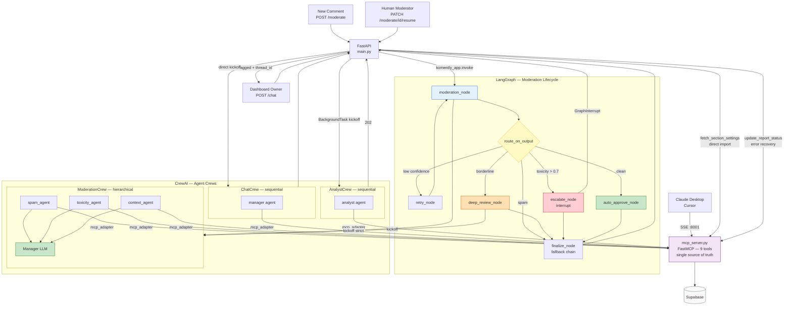

---

*May 2026*
